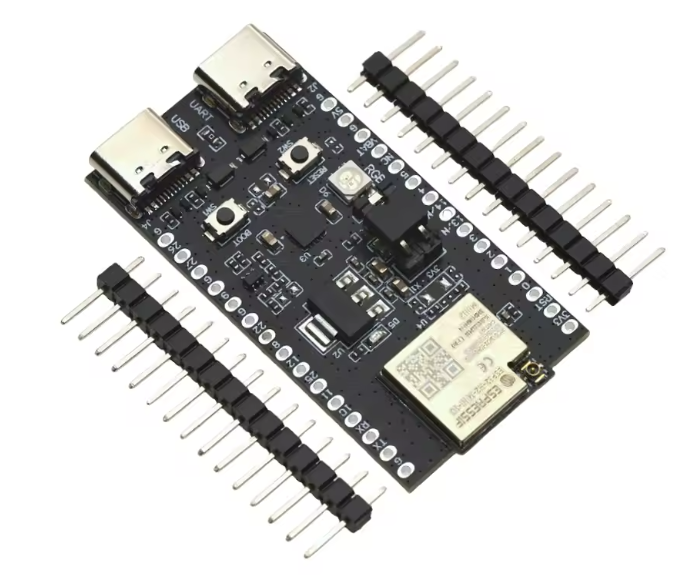

[](https://buymeacoffee.com/romlis)
# ESP32H2 Gas Counter with Zigbee2MQTT

**ESP32H2-based gas counter** that measures pulses from a gas meter and sends them to **Zigbee2MQTT**.  
Data is transmitted either periodically (timer) or when a predefined number of accumulated pulses is reached.  

*Inspired by [ZigbeeGasCounter](https://github.com/IgnacioHR/ZigbeeGasCounter).*

---

## Features

- Counts pulses from a meter using a reed sensor connected to a GPIO and GND pin. 
- Stores pulse count in **non-volatile memory (NVS)**.  
- Sends data to **Zigbee2MQTT**:  
  - On a configurable timer  
  - When accumulated pulses reach a threshold  
  - Triggers immediate transmission when **Boot button** is pressed  
- Supports **deep sleep** for low power.  
- LED for pulse indication.  

---

## Hardware

- ESP32H2 board  
- Gas meter with pulse output (e.g., BK-G4MT, G16-U25 Honeywell or similar)  
- Reed sensor: **Normally Open (NO)** – tested with GPS-01 Reed Switch 4×18 (Aliexpress)
- Optional battery  

---

## Software Requirements

- **ESP-IDF** v5.x  
- **Zigbee2MQTT** external converter  

---

## Wiring Example

| ESP32H2 Pin | Connection                                   |
|------------|--------------------------------------------|
| GPIO10     | Reed sensor signal                          |
| GND        | Reed sensor GND                             |
| VBat(Vcc)  | +3.3V (check voltage with series resistor)  |
| GND        | -3.3V                                       |
|            |                                             |



---

## Configuration

| Parameter                  | Description                                                |
|----------------------------|------------------------------------------------------------|
| `MUST_SYNC_MINIMUM_TIME`   | Time between automatic transmissions (ms)                 |
| `COUNTER_REPORT_DIFF`      | Number of pulses to trigger immediate transmission        |
| `PULSE_PIN`                | Connected reed sensor (GPIO10)                             |

---

## How It Works

1. ESP32H2 counts pulses from the gas meter.  
2. Pulses are stored in **NVS flash** to survive reboots or deep sleep.  
3. When **timer expires** or **pulse threshold** is reached data is sent to **Zigbee2MQTT**.  
4. Device enters **deep sleep** to save power until next event (pulse or timer).  

---

## Example Logs

```text
GAS_COUNTER: Counter loaded value=160
GAS_COUNTER: Setup deep sleep
GAS_COUNTER: Wake up from PULSE.
GAS_COUNTER: Checking if Zigbee radio should be enabled
GAS_COUNTER: Counter stored value=161
GAS_COUNTER: Configuring wake-up methods
GAS_COUNTER: Enabling wake-up timer , 162s
```

---

## Flashing

git clone https://github.com/romlisrl/Esp32H2GasCounter  
cd Esp32H2GasCounter  
idf.py erase-flash  
idf.py menuconfig  
idf.py build flash monitor  

---

## Notes

Make sure the Zigbee coordinator is running and paired.  
Configure Zigbee2MQTT to match firmware endpoint and cluster IDs.  
Optimized for battery-operated, low-power operation. 
