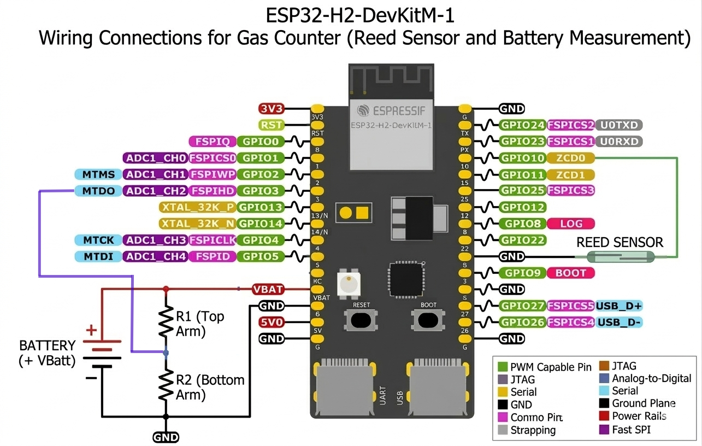

[](https://buymeacoffee.com/romlis)


# ESP32H2 Gas Counter with Zigbee2MQTT

**ESP32H2-based pulse counter** that measures pulses from utility meters with magnetic impulse output and sends them to **Zigbee2MQTT**.  

*Inspired by [ZigbeeGasCounter](https://github.com/IgnacioHR/ZigbeeGasCounter).*

---

## 🚀 Quick Start  

1. Flash the firmware onto your ESP32-H2 board.  
2. Copy the external converter to Zigbee2MQTT.  
   👉 See [External Converter](./zigbee2mqtt/)  
3. Restart Zigbee2MQTT completely (full restart required).  
4. Enable Zigbee pairing (**permit join**)  
5. Power on the board or press the Boot button to send the first data packet.  

---

## ⚠️ Power Notes  

- ESP32-H2 vBat pin works at **3.3V only**.  
- **Do NOT** connect vBat pin directly to 5V.  
- Use a voltage regulator or voltage divider if needed.  
- Can also be **powered from USB** (3.3V internally regulated).  

---

## ✨ Features

- Counts pulses from a meter using a reed sensor connected to a GPIO and GND pin. 
- Stores pulse count in **non-volatile memory (NVS)**.  
- Sends data to **Zigbee2MQTT**:  
  - On a configurable timer  
  - When accumulated pulses reach a threshold  
  - Triggers immediate transmission when **Boot button** is pressed  
- Supports **deep sleep** for low power.  
- LED for pulse indication.  

---

## 🔧 Hardware
  

- ESP32-H2-DevKitM-1 board /4MB Flash/ (Aliexpress)  
- Gas meter with pulse output (e.g., BK-G4MT, Honeywell BK-G6M or similar)  
- Reed sensor: **Normally Open (NO)** – tested with GPS-01 Reed Switch 4×18 (Aliexpress)
- Optional battery power supply  

---

## 📦 Requirements

- [**Zigbee2MQTT**](https://www.zigbee2mqtt.io/) with external converter configured  
- [ESP-IDF](https://docs.espressif.com/projects/esp-idf/en/latest/esp32/get-started/index.html) (used in installation by ESP-IDF)  

---

## 🔌 Wiring Example

| ESP32H2 Pin | Connection           |
|------------|-----------------------|
| GPIO10     | Reed sensor signal    |
| GND        | Reed sensor GND       |
| VBat(Vcc)  | +3.3V (or USB)        |
| GND        | -3.3V (or USB)        |
|            |                       |



---

## ⚙️ Configuration

| Parameter                  | Description                                                    |
|----------------------------|----------------------------------------------------------------|
| `MUST_SYNC_MINIMUM_TIME`   | Time between automatic transmissions (timer default 60m)       |
| `COUNTER_REPORT_DIFF`      | Number of pulses to trigger immediate transmission (default 10)|
| `INITIAL_COUNTER_VALUE`    | Initial value for the counter (2134 will be 21.34 m3)          |

---

## 🚀 How It Works

1. ESP32H2 counts pulses from the meter.  
2. Pulses are stored in **NVS flash** to survive reboots or deep sleep.  
3. When **timer expires** or **pulse threshold** is reached data is sent to **Zigbee2MQTT**.  
4. Device enters **deep sleep** to save power until next event (pulse or timer).  

---

## 📟 Example Logs

```text
GAS_COUNTER: Counter loaded value=160
GAS_COUNTER: Setup deep sleep
GAS_COUNTER: Wake up from PULSE.
GAS_COUNTER: Checking if Zigbee radio should be enabled
GAS_COUNTER: Counter stored value=161
GAS_COUNTER: Configuring wake-up methods
GAS_COUNTER: Enabling wake-up timer , 162s
```

---
## ⚡ Installation  

### ⚠️ Don't forget to create an [external converter](./zigbee2mqtt/) in Zigbee2MQTT first!  

### 1️⃣ Using ESP-IDF (recommended)  

- git clone https://github.com/romlisrl/Esp32H2GasCounter
- cd Esp32H2GasCounter
- idf.py erase-flash
- idf.py menuconfig (optional)
- idf.py build flash monitor

### 2️⃣ Using a pre-built binary (firmware.bin)  
Connect the board to the UART port (example: COM10 on Windows)  
```bash
esptool.py --chip esp32h2 --port COM10 write_flash 0x0 firmware.bin  
```

### 3️⃣ Using [ESPHome Web](https://web.esphome.io/) (firmware.bin)  

- Connect the board via USB/UART  
- Select firmware.bin file  
- Flash it directly from the browser  

---

## 🛠️ To Be Done

The following tasks are planned or pending implementation:

- [ ] **Implement battery voltage measurement via voltage divider on GPIO3** — include ADC reading and calibration.  
- [ ] **Add configuration for voltage divider parameters** (scaling factor, low-battery thresholds).  

---

## 📝 Notes

- Make sure the Zigbee coordinator is running and **permit join is enabled**
- After modifying the external converter, **restart Zigbee2MQTT completely** (do not use *Settings → Tools → Restart Zigbee2MQTT*)
